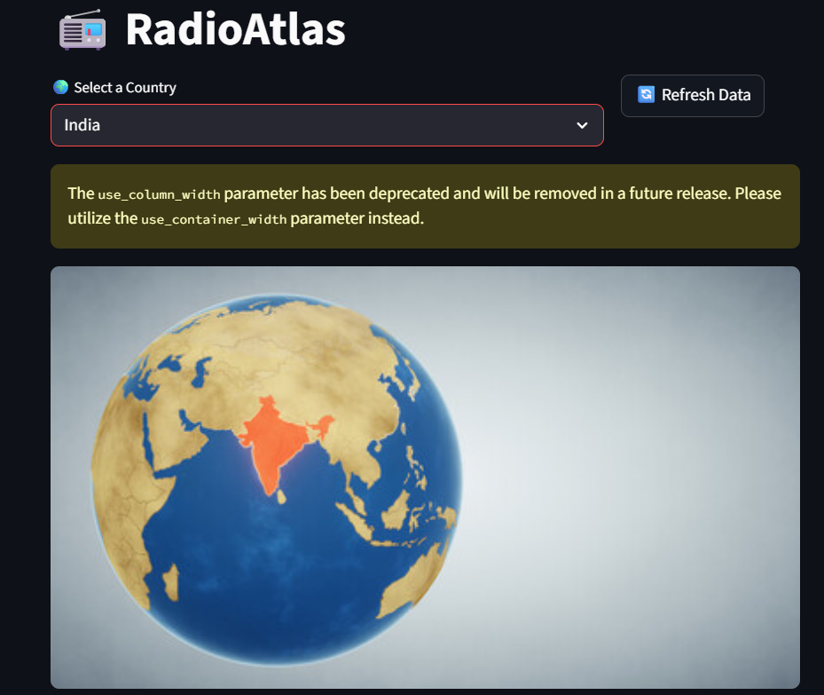
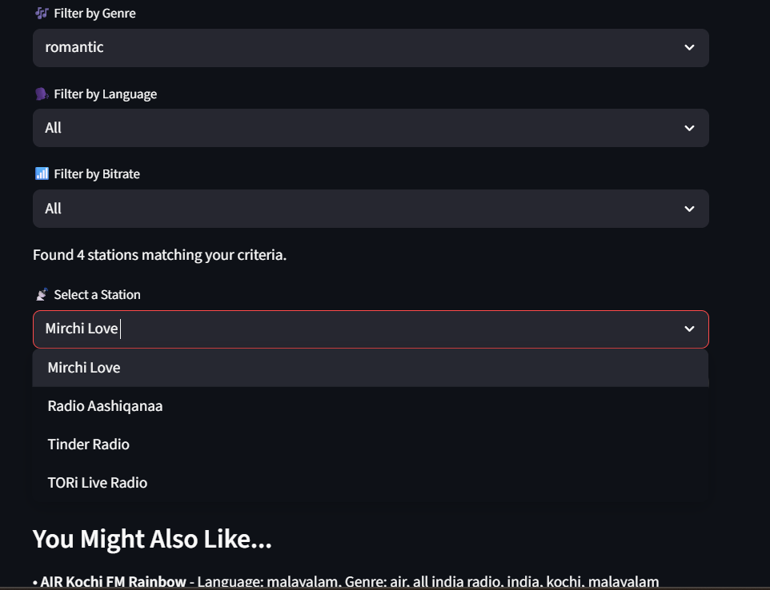
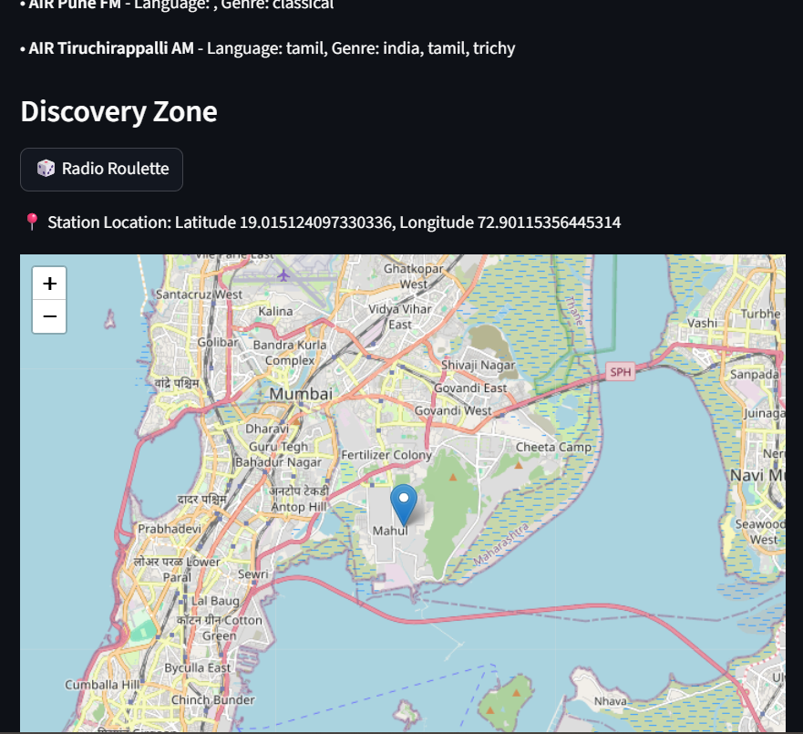

# 🎧 RadioAtlas

**RadioAtlas** is a Streamlit-based web application that allows users to explore and listen to radio stations from various countries. The app provides an intuitive interface to filter stations by genre, language, bitrate, and also includes a feature to save favorite stations. Additionally, it visualizes the geographical location of the stations on a map using `folium`.

## Features
- 🌍 **Country Selection**: Choose from a list of countries and explore radio stations from that region.
- 🔍 **Search & Filter**: Search for radio stations and filter them by genre, language, or bitrate.
- 📻 **Listen to Stations**: Play the selected radio stations directly within the app.
- ❤️ **Favorites**: Add stations to your favorites for easy access later.
- 📍 **Map Integration**: View the geographical location of radio stations on an interactive `folium` map.
- 🎨 **Flag Display**: See the country flag corresponding to the selected country.
- 💾 **Offline Caching**: Works offline after first load by caching station data.
- 🎲 **Radio Roulette**: Discover a random station, with a preference for your favorite genres/languages.
- 🤝 **Recommendations**: Get "You Might Also Like..." suggestions based on the selected station's genre.

## Screenshots

> _Below are some screenshots of the app in action:_

### Home Page


### Filters and Station List


### Station Map View


*You can add or update screenshots in the `screenshots/` folder.*

## Installation

To run the application locally, follow these steps:

1. Clone the repository:

   ```bash
   git clone https://github.com/your-username/RadioAtlas.git
   cd RadioAtlas
   ```

2. Install the required dependencies:

   ```bash
   pip install -r requirements.txt
   ```

3. Run the Streamlit app:

   ```bash
   streamlit run radioatlas_updated.py
   ```

## Dependencies

- [Streamlit](https://streamlit.io/) for the UI and frontend.
- [Folium](https://python-visualization.github.io/folium/) for displaying maps.
- [Streamlit-Folium](https://github.com/randyzwitch/streamlit-folium) to integrate Folium maps into Streamlit.
- [Requests](https://docs.python-requests.org/en/latest/) to fetch radio station data from the Radio Browser API.
- [Pillow](https://python-pillow.org/) for image processing of country flags.

You can install all dependencies using the provided `requirements.txt` file.

## Usage

1. Select a country from the dropdown list.
2. Search or filter radio stations by genre, language, or bitrate.
3. Choose a station from the filtered results and start listening!
4. View the station's location on a map and add it to your favorites for future listening.
5. Try the "Radio Roulette" feature to discover new stations.
6. Check out the "You Might Also Like" recommendations based on your selected station.

## Country Images

Country images are stored in the `assets` folder. The application currently uses globe-style images for countries.

The file naming convention for country images is:
- `globe_India.jpg`
- `globe_canada.png`
- `globe_brazil.jpg`
- `globe_uk.png`
- `globe_germany.png`

If you want to update the country images to the new map-style images, please refer to the `IMAGE_REPLACEMENT_INSTRUCTIONS.md` file for detailed instructions on how to prepare and install the new images.

## Offline Mode

RadioAtlas includes an offline caching feature that allows you to use the app without an internet connection after the first load:

1. When you first select a country, the app fetches station data from the Radio Browser API.
2. This data is automatically saved to a local cache file in the `cache` directory.
3. If you later use the app without an internet connection, it will load the cached data.
4. You can manually refresh the data by clicking the "🔄 Refresh Data" button when online.

## API

This app uses the [Radio Browser API](https://de1.api.radio-browser.info/) to fetch radio station data by country.

## Contributing

Feel free to submit issues or contribute to the project by creating a pull request. Here are some ways you can contribute:

1. Add support for more countries
2. Improve the UI/UX design
3. Add new features or enhance existing ones
4. Fix bugs or optimize performance
5. Update documentation

## License

This project is licensed under the MIT License. See the `LICENSE` file for details.
